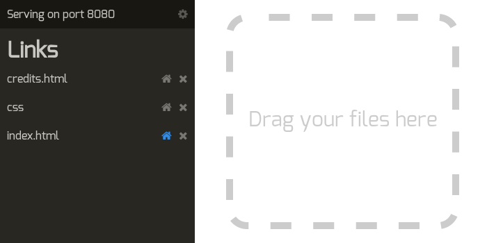

#ServeKit
## A static file server
ServeKit is a simple static file server with a GUI. Just drag and drop a file to serve it.  

## License
Please read `LICENSE.txt`. ServeKit is licensed under GPL v2.

##Install
ServeKit has been tested under Linux. It should be functionnal under other platforms, with some code modification.  
You will need to download and install node-webkit to run ServeKit.  

To execute it run :  
`nw /path/to/servekit/index.html`